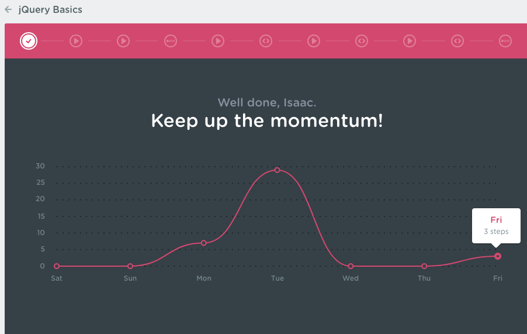
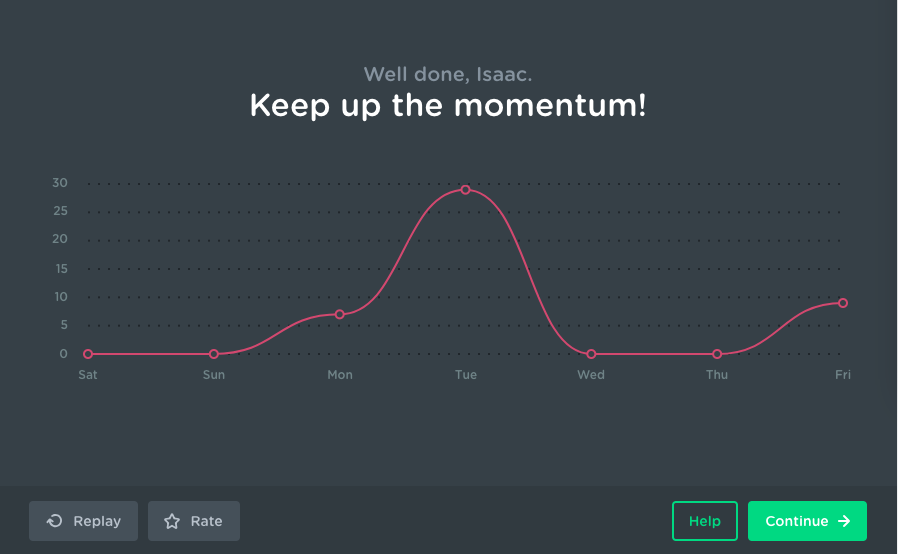
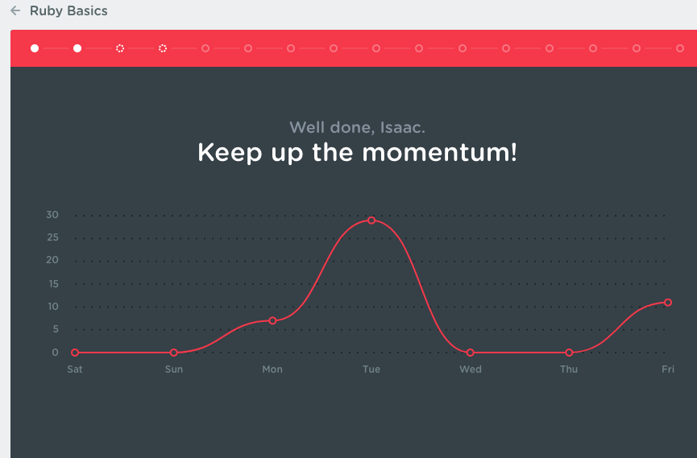
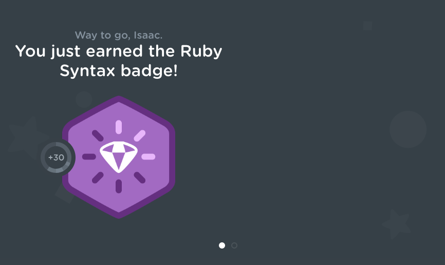
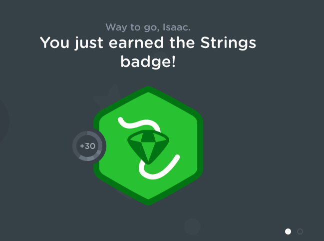
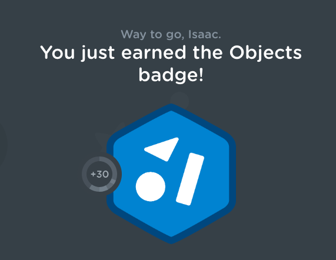
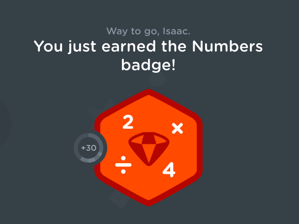
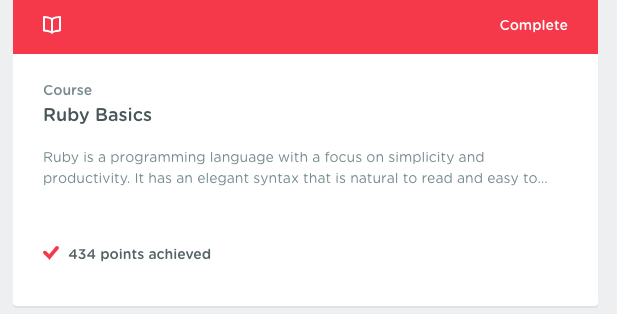
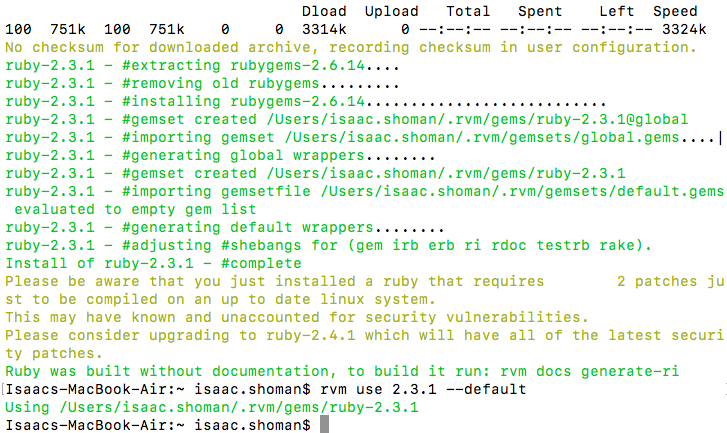
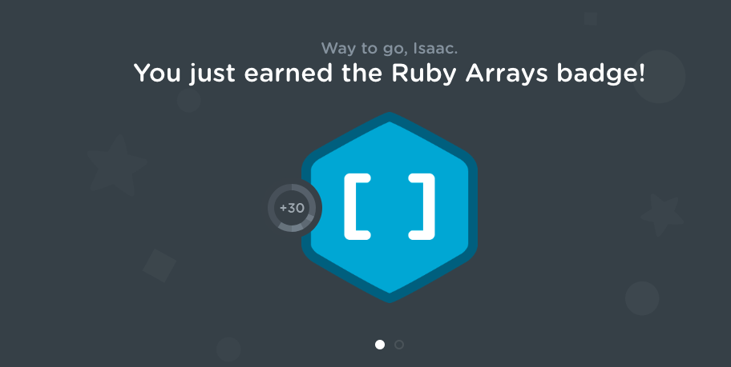

# Career plan/Self-Assessment

##### Isaac Shoman

## Self-Assessment

* Is there anything about the general job search and internship interview process you feel unprepared for? What would make you feel more comfortable and confident in your job search and internship interviews?

* Is there anything about searching for and transitioning into your future career in a technical field that you feel unprepared for? What would make you feel more comfortable and confident in this process?

1 -  I feel underprepared in my vanilla javascript abilities since we worked with mostly jQuery and Typescript.

2 -  I want to get more comfortable/revisit API calls both with AJAX and Promises.

3 - I am moving to Brooklyn upon the completion of my internship, and am not 100% sure what the culture of New York Tech is like, how to find meetups, etc.

4 - I want to gain at least a basic understanding of a backend language and how to build a database.

5 -

## Plan

1 and 2 - Tim (friend from Treehouse) hooked me up with a free professional account! So I am going to do their Fullstack JS track (includes NodeJS and AJAX)

3 - Found this awesome site for meet ups in NYC (https://www.builtinnyc.com/) and I'm going to spend some time perusing this to see what kind of events happen regularly and other things that they offer.

4 - I have been completing a Python masterclass on Udemy that has been great. I will continue to work through that. I will also checkout Treehouse's Ruby course as Tim said it is one of their strongest courses.

## Work

 * ##### Worked with my friend Tim to edit my cover letter for treehouse and gave it to him to give to their CFO and CTO. (https://docs.google.com/document/d/1OMLklYirAHolUnMkrrQaXp6CpeQIsdodlBEqlsIb2BU/edit?usp=sharing)

    Had a great meeting with my friend Tim who does marketing for Treehouse. He gave me a lot of insight into their vision as a company and gave me tips on how to better gear my cover letter to Londa (CPO) and Doug (HR). He gave feedback that a lot of my original language sounded too robotic. So I changed it to a more conversational tone.

 * ##### Started a jQuery course as part of the JS track.
 
 

 * ##### Switched to Ruby track due to a time out bug in the jquery course
 
 * ##### Completed all sections of the Ruby Basics course on Treehouse
 
 
 
 
 
 * ##### Installed Ruby on my computer
 
 * ##### Completed the Array's section of the "Collections source"
 

## Reflection & Next Steps

* Do you feel like you made improvement today? Are you more confident and comfortable in one or more areas? Why or why not?

  * Absolutely! It was great to talk with Tim about what it's like at Treehouse and the company vibe and all that. As well as getting help honing in my cover letter to be specific not only to the company, but to the specific people that would be reading it.
  * I also discovered that I really like Ruby a lot. I was working with Python but Ruby feels much more approachable and seems more likely that I will be able to learn enough between now and the capstone week to be able to create a basic database for my project. I'm pumped!

* Where are you at now? What are your next steps? What do you still need to accomplish to feel confident and prepared to begin your eventual job search?
  * I am going to continue working through the Ruby and JS courses on Treehouse. They are a great resource and I feel like the more I can learn before my time applying for the internships (if I'm not able to secure one at Treehouse). And adding Ruby/Rails to my stack, at least on a basic level would be a big confidence booster for me.
  * I will also continue to checkout that Meet Ups site to get a better feel for the range of available events and such.
